# Структура приложения Fashion Magazine

## Index

---

Компоненты:

* **HeaderBar** - компонет, который закреплен сверху экрана
    * Компоненты:
        * **MainLinkMainLink** 
          * по умолчанию: *активная ссылка*, которая ведет на главную страницу [LandingPage](#landingpage);
          * *неактивная ссылка*.
        * **MenuBtn** - кнопка, выдвигающая [меню бургер](#menuburger) справа.
    * Попеременные состояния фона:
        * прозрачный (по умолчанию);
        * полупрозрачный зеленый с размытым фильтром и белым текстом (активный).
    * Темы:
        * светлая (черный текст);
        * темная (белый текст) - по умолчанию.
* **Footer**
    * Компоненты:
        * **копирайт**;
        * **ссылки на социальные сети**:
            * Instagram (URL: https://www.instagram.com/skalar.ua/ );
            * Linkedin (URL: https://www.linkedin.com/company/skalar-it/mycompany/ ).
    * Темы:
        * светлая (черный текст на прозрачном фоне) - по умолчанию;
        * темная (белый текст на черном фоне).
        
--------------------------------------------------------------------------------------------
## Popups

--------------------------------------------------------------------------------------------

### MenuBurger

Компоненты:

* **Заголовок меню**
    * Компоненты:
        * **MainLink** - ссылка, которая ведет на главную страницу [LandingPage](#landingpage);
        * **MenuBtn** - кнопка в виде крестика, закрывающая [меню бургер](#menuburger).
* **Список меню** состоит из следующих пунктов:
    1. About - ссылка на страницу [AboutProjects](#aboutProjects);
    2. Projects - ссылка на страницу [ProjectsPage](#projectspage);
    3. Clients - ссылка на страницу [ClientsPage](#clientspage);
    4. Contact - ссылка на страницу [ContactPage](#contactpage).
* **Footer**: тема - светлая.

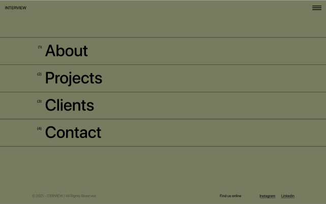

--------------------------------------------------------------------------------------------
## Страницы приложения

--------------------------------------------------------------------------------------------

### LandingPage 
URL страницы: /

* Index
    * **HeaderBar**
      * тема: темная;
      * состояние фона: вне секции ImageFullSection появляется *активный* фон.
        * MainLink: *неактивная ссылка*.
    * **Footer**
      * тема: светлая.
* **[ImageFullSection](#imagefullsection)**;
* **[IntroMainSection](#intromainsection)**;
* **[ProjectReview](#projectreview)**: тема - RightPicLeftNum;
* **[ProjectReview](#projectreview)**: тема - FullScreenPic;
* **[ProjectReview](#projectreview)**: тема - RightPicUpNum;
* **[ProjectReview](#projectreview)**: тема - DoublePics.

Метаданные:
* title - Fashion shop
* description - Fashion Shop with many of projects.
--------------------------------------------------------------------------------------------

### AboutProjects
URL страницы: /about/

* Index
  * **HeaderBar**
    * тема: светлая;
    * состояние фона: при прокрутке страницы на 150x появляется *активный* фон.
  * **Footer**
    * тема: светлая.
* **[AboutSection](#aboutsection)**;
* **[ServiceTemplateList](#servicetemplatelist)**;
* **[ContactForm](#contactForm)**.

Метаданные:
* title - About projects
* description - Details of our projects.
--------------------------------------------------------------------------------------------

### ContactPage
URL страницы: /contact/

* Index
  * **HeaderBar**
      * тема: светлая;
      * состояние фона: по умолчанию.
  * **Footer**
      * тема: светлая.
* **[ContactForm](#contactForm).**

Метаданные:
* title - Index
* description - Leave your feedback.
--------------------------------------------------------------------------------------------

### ProjectsPage
URL страницы: /project/

Компоненты:
* Index
  * **HeaderBar**
    * тема: темная;
    * состояние фона: при прокрутке страницы на 50x появляется *активный* фон.
  * **Footer**
    * тема: светлая.
* **[ProjectSection](#projectsection)**

Метаданные:
* title - All of Projects 
* description - See the full list of our projects.
___________________________________________________________________________________________

### ClientsPage
URL страницы: /client/

* Index
  * **HeaderBar**
    * тема: темная;
    * состояние фона: при прокрутке страницы на 50x появляется *активный* фон.
  * **Footer**
    * тема: темная.
* **[ClientSection](#clientitemlist)** 

Метаданные:
* title - Our clients
* description - Our best clients. Discover their sites.
___________________________________________________________________________________________

### ProjectInfo 
URL страницы: /project/{projectID}/, где projectID - ID проекта

Компоненты:
* Index
    * **HeaderBar**
        * тема: темная;
        * состояние фона: вне секции ImageFullSection добавляется *активный* фон.
    * **Footer**
        * тема: темная.
* **[ImageFullSection](#imagefullsection)**;
* **[ProjectDetailSection](#projectdetailsection)**;
* **[SwiperSection](#swipersection)**;
* **[NextSection](#nextsection)**;

Метаданные:
* title - Поле TITLE (динамически изменяется);
* description - Поле DESCRIPTION (динамически изменяется).

--------------------------------------------------------------------------------------------

## Компоненты

--------------------------------------------------------------------------------------------

### ImageFullSection
Компонент с изображением на всю высоту экрана. 

Изображение передается динамически через props.

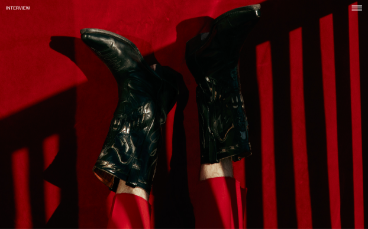

--------------------------------------------------------------------------------------------

### IntroMainSection
Компонент, содержащий ссылку на страницу [AboutProjects](#aboutProjects). Содержит следующий текст и изображения:

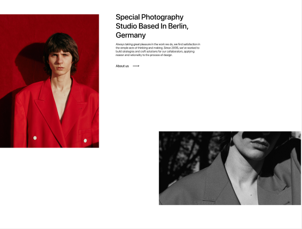

---
### ProjectReview
Компонент с кратким обзором проекта. Используется на главной странице [IndexPage](#indexpage).

* Состояние компонента:
    * *активный* - в случае отображения проекта на странице [ProjectsPage](#projectspage);
    * *неактивный* (по умолчанию).
  
* Привязка к странице:
    * содержит динамическую ссылку на деталь этого проекта - [ProjectInfo](#projectinfo).
    
Темы:

* **RightPicLeftNum**

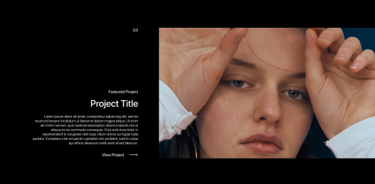

 * **FullScreenPic**

* **RightPicUpNum**

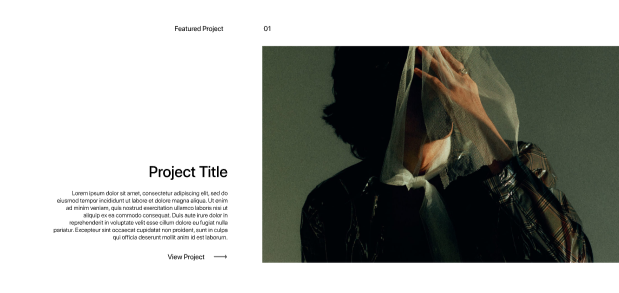

* **DoublePics**

--------------------------------------------------------------------------------------------

### AboutSection
Компонент, содержащий ссылку на страницу [ContactPage](#contactpage). Содержит следующий текст и изображения:

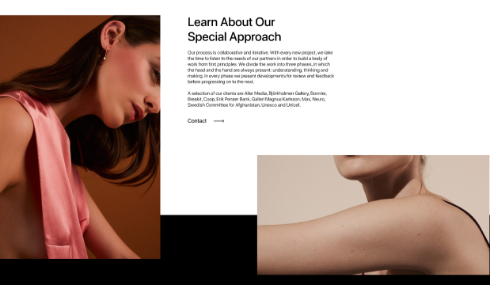

--------------------------------------------------------------------------------------------

### ServiceTemplate
Компонент, который содержит информацию о сервисах.
Используется на странице [AboutProjects](#aboutProjects).

Данные передаются внутренним компонентам с помощью API: `/api/service/content/`

* Компоненты:
    * **название и описание продукции**;
    * **название и описание бренда**.

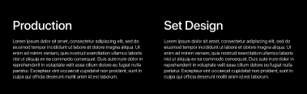

--------------------------------------------------------------------------------------------

### ServiceTemplateList
Секция с N-ным количеством компонентов [Template](#serviceTemplate), где N зависит от передачи
данных.

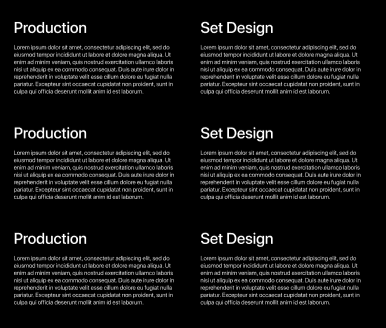

--------------------------------------------------------------------------------------------

### ContactForm
Форма обратной связи. Пользовательские данные передаются в базу данных `/api/form/result/` при отправке формы.

* Поля для получения данных:
    1. **Name**
        * обязательное поле;
        * текстовое значение;
        * максимальный размер - 25 символов.
    2. **Email**
        * обязательное поле;
        * тип email;
        * максимальный размер - 25 символов.
    3. **Message**
        * обязательное поле;
        * текстовое значение;
        * максимальный размер - 25 символов.
    
* Кнопка для подтверждения отправки формы:
    * **BtnSubmit** - кнопка с типом "submit".

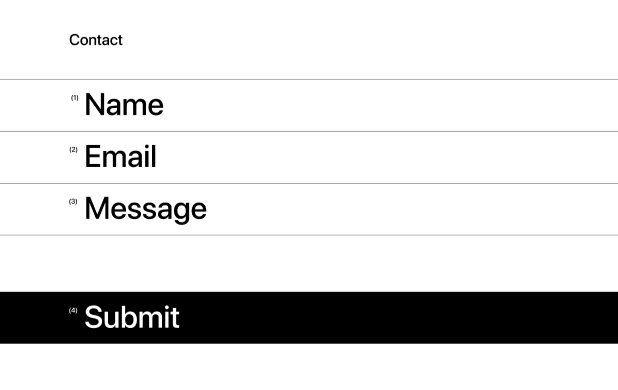

--------------------------------------------------------------------------------------------

### ProjectTemplate
Компонент на странице [ProjectsPage](#projectspage), отображающий блок существенной информации о проекте.

Данные передаются внутренним компонентам с помощью API: `/api/project/content/` .

* Компоненты:
    * **название и описание проекта**;
    * **название бренда**.
* Привязка к странице:
    * содержит динамическую ссылку на деталь этого проекта - [ProjectInfo](#projectinfo).
* Статус:
  * *активный* - отображается на главной странице;
  * *неактивный* - отображается только на странице проектов.

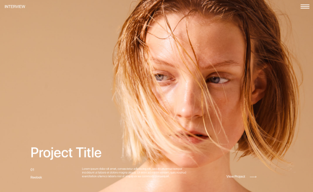

--------------------------------------------------------------------------------------------

### ProjectSection 
Секция с N-ным количеством компонентов [Template](#projectTemplate).

--------------------------------------------------------------------------------------------

### Item
Компонент на странице [ClientsPage](#clientspage). 

Содержит данные, которые предоставляются API `/api/client/content/` .

* Компоненты:
    * **название клиента**;
    * **ссылка на страницу клиента**.

--------------------------------------------------------------------------------------------

### ClientItemList
Секция с N-ным количеством компонентов [Item](#clientItem).

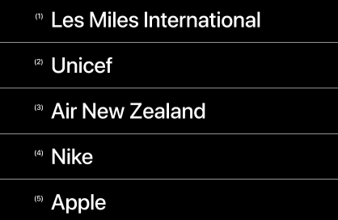

--------------------------------------------------------------------------------------------

### ProjectDetailSection
Секция с дополнительной информацией о проекте. 

Содержание зависит от привязки к конкретному проекту и передаче данных по `/api/project/content/`;

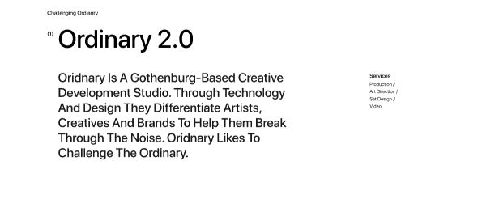

--------------------------------------------------------------------------------------------

### SwiperSection
Компонент с каруселью изображений, которые передаются по `/api/project/content/` вместе с остальными данными.

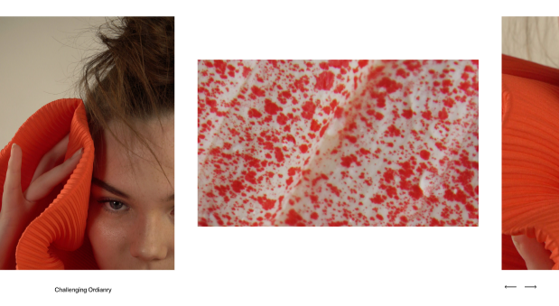

--------------------------------------------------------------------------------------------
### NextSection
Секция, содержащая ссылку на следующий проект (на проект со следующим порядковым номером или
  на первый, если следующего нет).

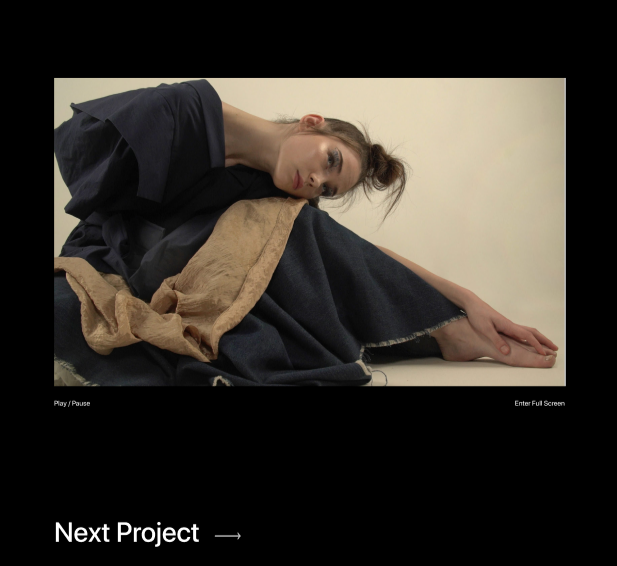

